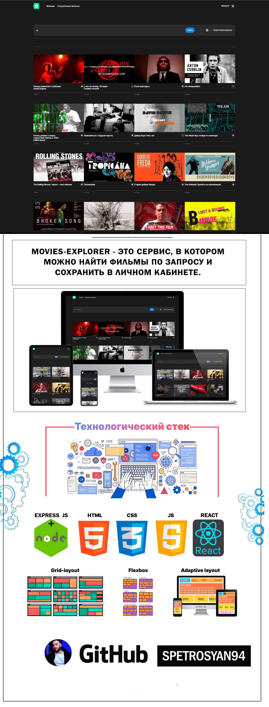

# Проект: "Movies-Explorer"

## Описание

Проект "Movies-Explorer" - представляет сервис, в котором можно найти фильмы по запросу и сохранить в личном кабинете.

## Скриншот

;

## Функциональность

На сайте реализованы следующие функции:

1. настроена инфраструктура и создан сервер на express;
2. подключена база данных, созданы схемы и модели ресурсов API;
3. реализовано логирование, аутентификация и авторизация на сервере;
4. бэкенд задеплоен на виртуальную машину;
5. свёрстаны компоненты на React, разметка портирована в его формат;
6. описана логика и вёрстка страниц регистрации, логина, редактирования профиля, сохранённых фильмов;
7. реализованы асинхронные GET- и POST-запросы к API;
8. проработаны авторизованные и неавторизованные состояния, сохранение фильмов в профиле;
9. полученные фильмы фильтруются на стороне клиента;
10. реализована отзывчивая mobile-first верстка;

## Технологии

Сайт "Movies-Explorer" разработан с использованием следующих технологий:

- HTML
- CSS
- JS
- React
- Express 
- БД MongoDB
- Авторизация и регистрация пользователей
- API
- Webpack
- БЭМ
- Отзывчивая вёрстка
- Семантическая вёрстка

## Дополнительная информация

- Фронтенд часть проекта реализована на React.

- Бэкенд часть проекта реализована на Node.js библиотеке express.

- База данных на сервере MongoDB.

<!-- - Ссылка на проект: [https://mesto.petrosyan.nomoredomainsmonster.ru](https://mesto.petrosyan.nomoredomainsmonster.ru) -->

<!-- - [Ссылка на макет в Figma](https://www.figma.com/file/6FMWkB94wE7KTkcCgUXtnC/%D0%94%D0%B8%D0%BF%D0%BB%D0%BE%D0%BC%D0%BD%D1%8B%D0%B9-%D0%BF%D1%80%D0%BE%D0%B5%D0%BA%D1%82?type=design&node-id=1%3A6015&mode=dev) -->

## Автор

**Петросян Сергей**

Проект "Movies-Explorer" разработан и поддерживается [Петросяном Сергеем](https://github.com/spetrosyan94) - https://github.com/spetrosyan94.

e-mail: [syspect@bk.ru](mailto:syspect@bk.ru)

telegram: [@solidhard1](https://t.me/SolidHard1) - https://t.me/SolidHard1
